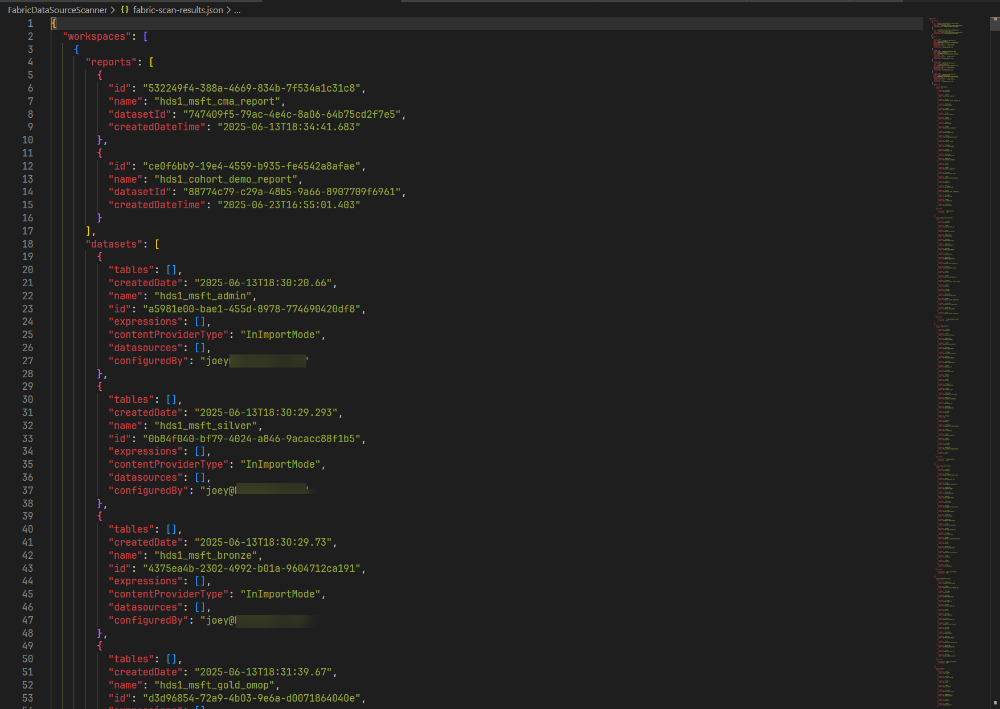
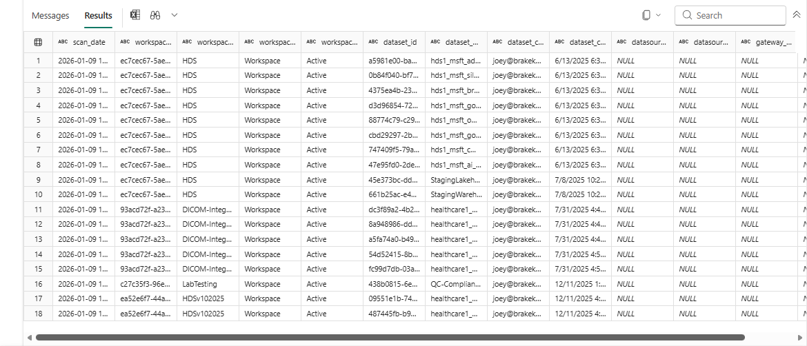
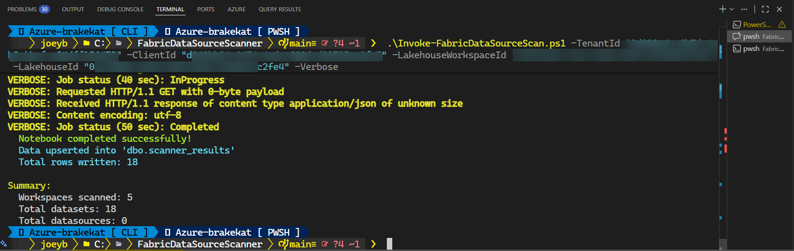

# FabricDataSourceScanner

Microsoft Fabric all-workspace data source scanning.

**Author:** Joey Brakefield  
**Last Updated:** January 9, 2026

## Overview

This PowerShell script scans all datasources across a Microsoft Fabric tenant using the Power BI Scanner API. It authenticates via an Azure Service Principal and retrieves comprehensive datasource information from all workspaces.

## Features

- **Service Principal Authentication** - Uses client credentials flow to authenticate against the Power BI API
- **Secure Secret Management** - Client secret retrieved from Azure Key Vault
- **Workspace Discovery** - Retrieves all workspaces modified within the last 30 days
- **Batch Processing** - Processes workspaces in batches of 100 to respect API limits
- **Comprehensive Scanning** - Extracts:
  - Dataset information (names, schemas, M expressions)
  - Datasource connection details
  - Dataflow configurations
  - Report metadata and lineage
- **Dual Output** - Results saved to both:
  - JSON file with full hierarchical structure
  - Fabric Lakehouse Delta table (optional) with flattened rows
- **Access Verification** - Checks SPN permissions before attempting Lakehouse write

## Prerequisites

- PowerShell 7.0 or later
- **Az.KeyVault** PowerShell module (`Install-Module Az.KeyVault`)
- Azure authentication (run `Connect-AzAccount` before executing)
- Azure Service Principal with the following permissions:
  - `Tenant.Read.All` or `Tenant.ReadWrite.All` (Power BI Admin API)
  - Contributor role on the target Lakehouse workspace (if using Lakehouse output)
- Service Principal must be enabled for Power BI Admin API access in the Fabric Admin Portal
- Access to the Azure Key Vault containing the service principal secret

## Usage

```powershell
# First, authenticate to Azure
Connect-AzAccount

# Basic usage (JSON output only)
.\Invoke-FabricDataSourceScan.ps1 -TenantId "<tenant-id>" -ClientId "<client-id>" `
    -KeyVaultName "<keyvault-name>"

# With Lakehouse output ⭐ --> Recommended for future Power BI reporting 😀
.\Invoke-FabricDataSourceScan.ps1 -TenantId "<tenant-id>" -ClientId "<client-id>" `
    -KeyVaultName "<keyvault-name>" `
    -LakehouseWorkspaceId "<workspace-guid>" -LakehouseId "<lakehouse-guid>"

# Custom secret name
.\Invoke-FabricDataSourceScan.ps1 -TenantId "<tenant-id>" -ClientId "<client-id>" `
    -KeyVaultName "<keyvault-name>" -SecretName "my-spn-secret"

# Using environment variables for tenant and client
$env:AZURE_TENANT_ID = "<tenant-id>"
$env:AZURE_CLIENT_ID = "<client-id>"
.\Invoke-FabricDataSourceScan.ps1 -KeyVaultName "<keyvault-name>"

# Custom output path
.\Invoke-FabricDataSourceScan.ps1 -TenantId "<tenant-id>" -ClientId "<client-id>" `
    -KeyVaultName "<keyvault-name>" -OutputPath "./my-scan-results.json"
```

## Parameters

| Parameter | Required | Default | Description |
|-----------|----------|---------|-------------|
| `TenantId` | No | `$env:AZURE_TENANT_ID` | Azure AD tenant ID |
| `ClientId` | No | `$env:AZURE_CLIENT_ID` | Service Principal application ID |
| `KeyVaultName` | Yes | - | Azure Key Vault name containing the client secret |
| `SecretName` | No | `fabric-scanner-secret` | Name of the secret in Key Vault |
| `OutputPath` | No | `./fabric-scan-results.json` | Output file path for JSON results |
| `LakehouseWorkspaceId` | No | - | Fabric workspace ID containing the target Lakehouse |
| `LakehouseId` | No | - | Target Lakehouse ID for storing scan results |
| `NotebookPath` | No | `./scanner_results_to_lakehouse.ipynb` | Path to the PySpark notebook for loading data (auto-created if missing) |

## Output

### JSON Output

The script generates a JSON file containing:

- **scanDate** - UTC timestamp of the scan
- **totalWorkspaces** - Number of workspaces scanned
- **workspaces** - Array of workspace objects with:
  - Datasets and their datasources
  - Tables and column schemas
  - M expressions
  - Dataflows
  - Reports
- **summary** - Aggregated statistics including datasource type counts

### Lakehouse Output

When Lakehouse parameters are provided, results are also written to a Delta table named `scanner_results` with the following schema:

| Column | Type | Description |
|--------|------|-------------|
| `scan_date` | TIMESTAMP | UTC timestamp when the scan was performed |
| `workspace_id` | STRING | Workspace GUID |
| `workspace_name` | STRING | Workspace display name |
| `workspace_type` | STRING | Workspace type (e.g., Workspace, PersonalGroup) |
| `workspace_state` | STRING | Workspace state |
| `dataset_id` | STRING | Dataset GUID |
| `dataset_name` | STRING | Dataset display name |
| `dataset_configured_by` | STRING | User who configured the dataset |
| `dataset_created_date` | STRING | Dataset creation date |
| `datasource_type` | STRING | Type of datasource (e.g., Sql, Web, File) |
| `datasource_id` | STRING | Datasource GUID |
| `gateway_id` | STRING | Gateway GUID (if applicable) |
| `connection_details` | STRING | JSON string with connection details |

The table is created automatically if it doesn't exist, and new scan results are appended to preserve historical data.

**Note:** The script supports both standard Lakehouses and schema-enabled Lakehouses:
- **Standard Lakehouse**: Uses the Table Load API to create/append Delta tables
- **Schema-enabled Lakehouse**: Automatically detects, imports a PySpark notebook to Fabric, attaches it to the Lakehouse, and runs it for UPSERT (MERGE) operations

### Notebook Loading (Schema-Enabled Lakehouses)

For schema-enabled Lakehouses, the script:
1. Stages data as CSV in `Files/scanner_staging_*.csv`
2. Imports `scanner_results_to_lakehouse.ipynb` to Fabric workspace
3. Attaches the Lakehouse to the notebook
4. Runs the notebook to perform UPSERT (MERGE) into `dbo.scanner_results`
5. Cleans up staging CSV files

The notebook uses Delta Lake MERGE logic with composite key `(workspace_id, dataset_id)` for deduplication. The `scan_date` column is updated on each run to reflect the most recent scan.

## Example Output

### JSON Output Example

The script generates a `fabric-scan-results.json` file with the complete scan results:



### Lakehouse Table Results 

After running the scanner with Lakehouse output, the `scanner_results` table contains all discovered datasets:



### Successful Run Output

Example console output from a successful scan run:



## Changelog

### v1.5.0 - January 9, 2026
- **Automated Notebook Creation & Loading**: For schema-enabled Lakehouses, script now automatically:
  - Creates the PySpark notebook locally if it doesn't exist
  - Imports the notebook to Fabric workspace via REST API
  - Attaches the target Lakehouse to the notebook
  - Runs the notebook to load staged CSV data into Delta table
- **UPSERT Logic**: Uses MERGE (upsert) with composite key `(workspace_id, dataset_id)`
- Added `NotebookPath` parameter to specify the local notebook file
- `scan_date` is updated on each run to reflect the most recent scan
- Staging CSV files are automatically cleaned up after successful load

### v1.4.0 - January 9, 2026
- **Schema-enabled Lakehouse Support**: Added automatic detection and handling of schema-enabled Lakehouses
- Falls back to direct OneLake file write when Table Load API returns `UnsupportedOperationForSchemasEnabledLakehouse`
- Writes to `Tables/<schema>/<table>/` path for schema-enabled Lakehouses
- Improved token handling with separate scopes:
  - Power BI Admin API (`analysis.windows.net`) for scanner operations
  - OneLake Storage (`storage.azure.com`) for file uploads
  - Fabric Core API (`api.fabric.microsoft.com`) for table operations

### v1.3.0 - January 9, 2026
- **Lakehouse Integration**: Added support for writing scan results to a Fabric Lakehouse Delta table
- Added `LakehouseWorkspaceId` and `LakehouseId` parameters
- Script verifies SPN access to Lakehouse before attempting write
- Creates `scanner_results` table automatically if it doesn't exist
- Flattens hierarchical data to rows with scan date for historical tracking
- Uses OneLake API for file upload and Fabric Table Load API for Delta table creation

### v1.2.0 - January 9, 2026
- **Security Enhancement**: Client secret is now retrieved from Azure Key Vault instead of command line parameter
- Added `KeyVaultName` parameter (required)
- Added `SecretName` parameter (default: `fabric-scanner-secret`)
- Added dependency on `Az.KeyVault` module
- Removed `ClientSecret` command line parameter

### v1.1.0 - January 9, 2026
- Fixed ISO-8601 date format for `modifiedSince` parameter (now uses round-trip format with URL encoding)
- Changed workspace lookback from 365 days to 30 days (API limitation)
- Added verbose logging for date encoding and API endpoints

### v1.0.0 - Initial Release
- Initial implementation of Fabric datasource scanning
- Service Principal authentication
- Batch processing for large tenants
- JSON export with summary statistics
